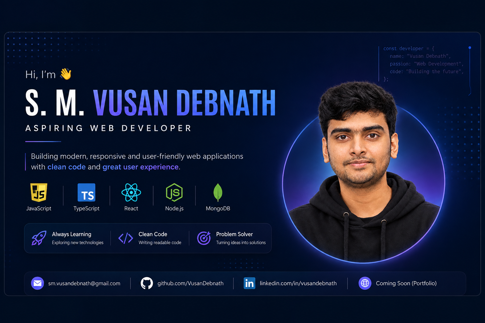

  

# Hi, I'm S. M. Vusan Debnath 👋

### Aspiring Web Developer | JavaScript & TypeScript | React

---

## 👨‍💻 About Me

I'm an aspiring web developer passionate about building modern and user-friendly web applications.

I enjoy learning new technologies, improving my programming skills, and turning ideas into real-world projects.

---

## 🌱 Currently Learning & Exploring

- 🔭 Exploring TypeScript and React
- 💻 Building web applications with JavaScript and React
- 📚 Improving my frontend development skills
- 🚀 Learning modern tools and technologies for web development

---

## 🛠️ Skills & Technologies

  
  
  
  
  
  
  

---

## 🌐 Connect With Me

  
  
  

---

## 📊 GitHub

I actively use GitHub to practice, learn, and build projects while improving my development skills.

---

⭐ Thanks for visiting my profile!
